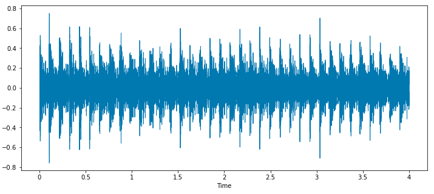
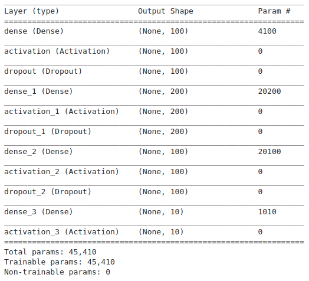

# 1. Introdução
               
O uso da captura do áudio para o fim de monitoramento tem diversas vantagens, como por exemplo requer menos sensores, já que pode ser usado na perspectiva do uso exclusivo do microfone sendo que este sensor fica entre os 2 com maior importância durante a detecção dos tipos mais variados de eventos, atrás apenas da câmeras.
               
Monitoramento de ambientes e classificação de eventos sonoros ainda não é uma tarefa fácil de ser resolvida, tanto que desde 2013 plataformas como o DCase e o Kaggle propõem competições na área de classificação de sons para que pesquisadores da comunidade possam realizar trabalhos e avançar o estado da arte na área.

Uma dessas competições foi a Urban Sound 8K que propõe o uso de uma base de dados composta de áudios rotulados em 10 categorias diferentes relacionados a sons urbanos.

Considerando esta base de dados iremos realizar alguns experimentos a fim de treinar modelos inteligentes capazes de classificar corretamente cada um dos arquivos de áudio de acordo com sua categoria, para isto iremos utilizar o Python e suas bibliotecas capazes desde carregar o arquivo de áudio em memória para ser manipulado, pre-processar as informações contidas no arquivo de áudio a fim de se extrair informações úteis para então com estas informações treinar e avaliar nossos modelos inteligentes.
               
# 2. Urban Sound 8K

Explicando mais detalhadamente, esta base de dados é constituída de 8732 áudios de cerca de 4 segundos rotulados entre 10 categorias, sendo elas: ar-condicionado, buzina de carro, crianças brincando, latido de cachorro, furadeira, sons de motor, tiro de arma de fogo, som de marreta, sirene e música de rua.

As categorias dos sons presentes nesta base de dados estão distribuídos da seguinte forma:

Tabela 1 : Número de instâncias por categoria
Categoria | Número de Instâncias
-- | --
Ar-condicionado | 1000
Buzina de carro | 429
Crianças brincando | 1000
Latido de cachorro | 1000
Furadeira | 1000
Sons de motor | 1000
Tiro de arma de fogo | 374
Som de marreta | 1000
Sirene | 929
Música de rua | 1000

      
Para termos de visualização podemos carregar um desses arquivos de áudios e plotar o sinal, para isto foi selecionado um sinal da categoria marreta a seguir:

# 3. Ferramentas utilizadas

Nos experimentos que serão abordados adiante foram usadas principalmente essas 6 bibliotecas do Python:

    • Librosa: para carregamento e pré-processamento dos arquivos de áudio.
    • Numpy: para cálculo númerico e operações entre arrays.
    • Pandas: para carregamento dos metadados dos arquivos de áudio.
    • Matplotlib: para visualização de dados.
    • Scikit-learn: para importação de modelos de aprendizado de máquina clássicos e para avaliação do desempenho dos classificadores.
    • Tensorflow: para construção de redes neurais artificiais.

# 4. Pré-processamento dos dados

Como métodos de pré-processamento do arquivos de áudio foram utilizada a abordagem do Mel Frequency Cepstral Coefficients (MFCC) que é a representação do espectro de potência de curto prazo de um som.

# 5. Modelos

Como modelos classificadores foram utilizados  Naive Bayes, K-Vizinhos Mais Próximos, Árvore de Decisão, Máquina de Vetores de Suporte, Floresta Aleatória, AdaBoost, Bagging e Redes Neurais Artificiais (RNA), todos presentes e prontamente disponíveis nas bibliotecas Scikit-learn no caso dos modelos clássicos como no Tensorflow no caso dos modelos baseados em Redes Neurais.

# 6. Métricas de avaliação

Para métricas de avaliação foram usadas Acurácia, Precisão, Revocação, F1-Score e Matriz de Confusão, todas já bem estabelecidas na litetura e disponíveis para uso atavés do Scikit-learn.
# 7. Experimentos

Os testes realizados foram conduzidos da seguinte forma: (1) carregamento dos 8732 arquivos de áudio a partir do uso da Librosa, (2) cálculo do MFCC de cada arquivo de áudio retornando um vetor de 40x173 posições para cada arquivo representando 40 coeficientes e 173 instantes de tempo, (3) cálculo da média do mfcc por instante de tempo, retornando um vetor de 40 posições para cada arquivo de áudio, (4) separação da base de dados agora no formato 8732x40, em 3 bases distintas de treinamento, avaliação e teste representando 70%, 10% e 20% da base original, respectivamente; (5) treinamento e avaliação do modelo.

Na Tabela 2 estão descritos os resultados dos testes de cada modelo na base de teste, sendo que o modelo que obteve os melhores resultados foi o modelo de Floresta Aleatória chegando num F1-Score de 87.63%.

Entrando em mais detalhes de cada modelo, todos com exceção da Rede Neural foram utilizados na sua configuração padrão do Scikit-learn, sendo que durante a inicialização não foram ajustados parâmetros ou hiper-parâmetros de nenhum e em relação a Rede Neural sua arquitetura está definida na figura a seguir.

Tabela 2 : Desempenho dos modelos inteligentes no conjunto de teste
Modelo |Acurácia (%) |Precisão (%) |Revocação (%) |F1-Score (%)
--- | --- | --- | --- | ---
Árvore de Decisão |68.92% |68.85% |67.73% |68.12%
Naive Bayes |47.62% |49.82% |49.51% |48.18%
KNN |84.32% |85.48% |82.03% |82.78%
Floresta Aleatória |88.15% |89.50% |86.50% |87.63%
Ada Boosting |45.05% |46.20% |46.49% |45.99%
Bagging |81.85% |83.62% |80.39% |81.53%
SVM |61.48% |67.99% |58.95% |60.29%
Rede Neural |74.93% |79.92% |72.45% |73.84%

# 8. Considerações finais

Em relação aos resultados encontrados é necessário se observar que a Floresta Aleatória sem ajustes obteve um resultado bem interessante, ultrapassando inclusive a Rede Neural, que geralmente é o primeiro modelo a se pensar quando se considera o uso de modelos inteligentes atualmente, mas também não deve-se afirmar que este é o melhor modelo para este problema ou para classificação de áudios como um todo, mas somente que neste contexto e com o pré-processamento e parâmetros utilizados foi o que se destacou com melhores resultados. 

Como continuação deste estudo poderia investigar uma otimização de parâmetros de todos os modelos, outros tipos de pré-processamento como por exemplo o uso de Transformada de Fourier de Tempo Curto (STFT) ou Projeção de Espectrograma e outras arquiteturas de Redes Neurais.

Deve-se comentar que todos os códigos que resultaram nos experimentos aqui apresentados estão disponíveis para leitura e questionamentos.

Referências

https://www.analyticsvidhya.com/blog/2022/04/guide-to-audio-classification-using-deep-learning/

https://www.analyticsvidhya.com/blog/2022/03/implementing-audio-classification-project-using-deep-learning/

https://github.com/AmritK10/Urban-Sound-Classification/tree/master

https://towardsdatascience.com/urban-sound-classification-using-neural-networks-9b6fcd8a9150

https://urbansounddataset.weebly.com/urbansound8k.html
